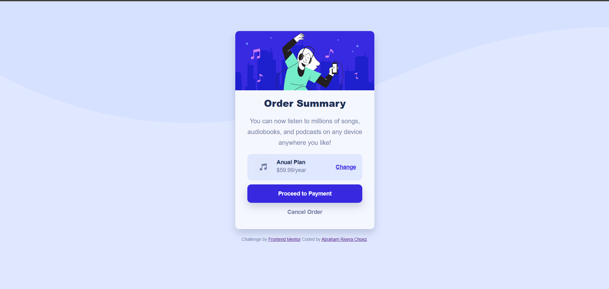

Esta es mi solución al desafío [Order Summary Card](https://www.frontendmentor.io/challenges/order-summary-component-QlPmajDUj).

## 📸 Screenshot
 
## 🔗 Links
- Repositorio: [GitHub](https://github.com/Abraham2904/order-summary-component-main)
- Demo en vivo: [GitHub Pages](https://Abraham2904.github.io/order-summary-component-main/)
## 🛠️ Built with
- HTML5 semántico
- CSS3
- Flexbox
- Mobile-first workflow

## 📚 What I learned
- Cómo usar `object-fit` para imágenes responsivas.
- Aplicar media queries con `min-width` y `max-width`.
- Mejorar accesibilidad con contraste y tamaños de fuente.

## 👤 Author
- Frontend Mentor - [@Abraham2904](https://www.frontendmentor.io/profile/Abraham2904)